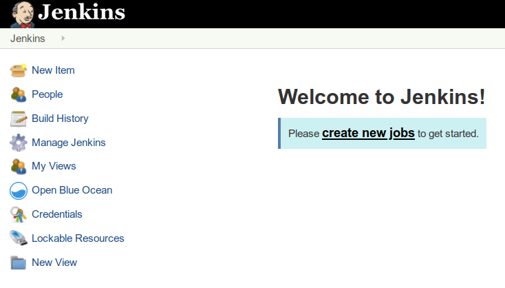

# Create and setup a Jenkins server

In this exercise you will:

## Initial start

In order for us to start using Jenkins, we need a Jenkins server.
Most Linux distributions have it in their own package repository, or you can download it directly from [Jenkins.io](https://jenkins.io/download/).

In this exercises, we are going to spin up a Jenkins instance through [Docker](https://www.docker.com/) and docker-compose.

Make sure that you do not have anything listening on port 8080, in case there are any existing docker container from other exercises. (*docker ps will help you see if any containers is ocupying the port*)

## Tasks

* Fork the repository to your own github account.
* Clone the forked repository on your provided ubuntu cloud machine.
* `cd` into the repository folder
* Run `docker-compose up -d` to run the jenkins docker image
* Examine that the container is starting by issuing a `docker-compose ps` and see that the state of the container is `up` like the below example

```bash
$ docker-compose ps
           Name                          Command               State                                    Ports
-----------------------------------------------------------------------------------------------------------------------------------------------
jenkins-micronaut_jenkins_1   /sbin/tini -- /usr/local/b ...   Up      0.0.0.0:50000->50000/tcp, 0.0.0.0:8080->8080/tcp, 0.0.0.0:8443->8443/tcp
```

## Setup your jenkins

Next step is to perform the initial Jenkins configuration, in order to do that we need to obtain an inital password. The initial password can be obtained by running the command below:

`docker-compose logs -f <container name>`

This password needs to be copied, as we will be using it soon, the password is unique for each installation, in our case and in this example the pasword is `b294a570736d4f06a5a5b0157e611b1f`. Yours will be different.


```bash
jenkins_1  | *************************************************************
jenkins_1  | *************************************************************
jenkins_1  |
jenkins_1  | Jenkins initial setup is required. An admin user has been created and a password generated.
jenkins_1  | Please use the following password to proceed to installation:
jenkins_1  |
jenkins_1  | b294a570736d4f06a5a5b0157e611b1f
jenkins_1  |
jenkins_1  | This may also be found at: /var/jenkins_home/secrets/initialAdminPassword
jenkins_1  |
jenkins_1  | *************************************************************
jenkins_1  | *************************************************************
```

## Navigate to jenkins, is it working?

If you see a similar message when running `docker-logs` as above, you should now be able to navigate to your Jenkins instance! Go to `http://<your-hostname>:8080` and you will be presented with a screen where you input the password you just copied. If you're trying this on you own computer using docker, you'll use `localhost` as `<your-hostname>` otherwise for the purpose of this excercise, use the provided public hostname/ip.

On the following screen select `Install Selected Plugins`.

Create the first Admin User, remember/write down the username and password, as we will use it througout the day.
Save and finish.

Next you'll need to input your correct Jenkins url. The correct hostname should be selected by default, but if not use the hostname you were provided. If you are trying this at home on your local pc use `localhost` instead, like: `http://localhost:8080`.

After this, you are ready to use Jenkins!


