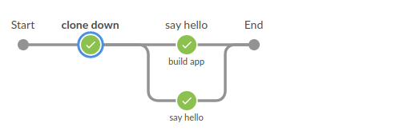

# Editing your pipeline

In the previous exercise, we used the GUI to create our pipeline. Although it is helpful, we also need to be sufficient to edit the script by hand as well.
In this exercise you will:

* Use the replay feature for fast iteration of build steps.
* Use different agents for building steps
* Use stash and unstash for sending your data from one agent or step to another
* Use the built-in test report plugin as a post step to show reports of Unit tests for each build.

## Replay an old pipeline

Typically a Pipeline will be defined inside of the classic Jenkins web UI, or by committing to a `Jenkinsfile` in source control.

Unfortunately, neither approach is ideal for rapid iteration, or prototyping, of a Pipeline.

The "Replay" feature allows for quick modifications and execution of an existing Pipeline without changing the Pipeline configuration or creating a new commit.

### Tasks

We want to clean up after our run, deleting the workspace.

To use the "Replay" feature:

Currently the Replay feature is not available using the Blue Ocean ui, so we use the classic ui. 

* Select a previously completed run in the build history.
* In the upper right corner click the 'exit' icon labelled 'Go to classic'.
* You should now have a different ui showing the same build.
* Click **Replay** in the left menu.
* You can now make changes to the pipeline code.
* Make modifications to the buttom of the `build app` stage: first list the contents of the workspace, then use the `deleteDir()` keyword to delete the workspace, and finally list the content again after the deletion, to verify that they were deleted.
    * If you get stuck figuring out the declarative syntax, see the folloing section `Getting help from Jenkins`.
* Click **Run**.
* Check the results of changes

Once you are satisfied with the changes, you can use **Replay** to view them again, copy them back to your Pipeline job or `Jenkinsfile`, and then commit them using your usual engineering processes.

## Getting help from Jenkins

There are two different code generators in Jenkins when using the classical UI.

* **Snippet generator** is there to help you make the right syntax for the different steps inside a job.
* **Declarative Directive Generator** is there to help you make the right syntax for the structure of the job itself, with agents, parallel runs etc.

> Note: the pipeline editor in Blue oceac combines both of the generators into one more easily useable tool. The snippit generator does have it's merrits as a help for the syntax itself when you are editing the pipeline on your computer.

To generate a step snippet with the Snippet Generator:

* Navigate to the Pipeline Syntax link from a configured Pipeline, or at http://<your hostname>/pipeline-syntax.
* Select the desired step in the Sample Step dropdown menu
* Use the dynamically populated area below the Sample Step dropdown to configure the selected step.
* Click Generate Pipeline Script to create a snippet of Pipeline which can be copied and pasted into a Pipeline.

## Building on different machines

It's common to have different types of hardware to run your pipeline. Some things can be done on inexpensive low performance hardware, while other things require extra ram, or a specific piece of hardware to be run on.

This is achieved by agent labels depicting which of the agents this particular step should be run on.

When we transfer our job from one agent to another, we usually also need to transfer our repository data along with other already made binaries.

> Note: everytime you change agent (both node and docker agent), Jenkins will clone down the repository again. If you do not want that, you need to add the option [skipDefaultCheckout(true)](https://jenkins.io/doc/book/pipeline/syntax/#options) to the stages that does not need this option, or in the [stages part in the top](https://jenkins.io/blog/2018/04/09/whats-in-declarative/#new-options)

### Tasks

We want a pipeline that on the stages looks like this:


* Make a new stage called __clone down__.
* Make that stage run on the agent with a node that has the label **host**
* Inside that stage, make a `stash` step that excludes the .git folder, and has the name "code"
* In the stage `build app`, add the `skipDefaultCheckout(true)` option
* Add a new first step where you unstash your "code" stash.
* Run the pipeline and see that the build still runs

## Test reporting

Running a Gradle test and display the result

With `Preparation` now being done, we need to build the code and store the result.
For each of the bullet points, try to build it to make sure it works before moving to the next.

### Tasks

* Add a new stage in parallel to `build app`, called `test app` by copying `build app` and deleting its steps besides `unstash 'code'`
* Call the shell script 'ci/unit-test-app.sh' to run the unit tests made
* In order for you to get the unit tests out in the UI, add another step with the following; `junit 'app/build/test-results/test/TEST-*.xml'`
* Click on the "Tests" tab to see the result

## Post steps

```
    post {
        always {

            deleteDir() /* clean up our workspace */
        }
```

