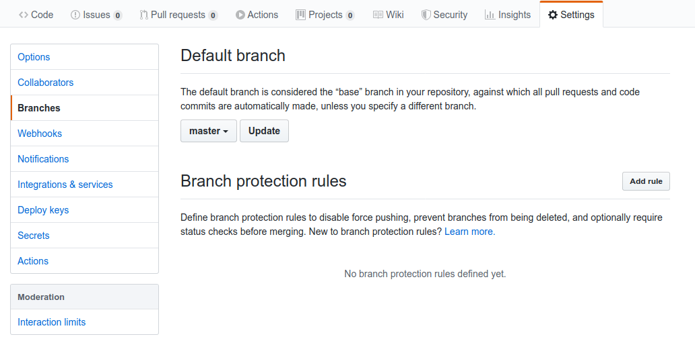

# Pull Request based workflow

The defacto-standard workflow now-adays is the Pull Request workflow (also known as the [GitHub flow](https://guides.github.com/introduction/flow/))

https://jenkins.io/doc/book/pipeline/syntax/#built-in-conditions

Just like the conditional branching exercise, this will also use the `when` section of the pipeline.

If you did not manage to get the exercise done, you can use our [example pipeline](../examples/jenkinsfile_conditional) instead.

Besides the `branch` condition, when also has a `changeRequest()` condition, checking if what

```
        stage('Change request') {
          when { changeRequest() }
          steps {
            sh 'echo "this is a change request"'
          }
        }
```

### Tasks

We want the `component test` stage only to be run if the branch is named "master" or if it is a change request.

> Hint: you can use the `anyOf` to have multiple conditions that apply to your stage.

## Securing your master branch



We do not want everybody to be able to push directly to master, without the CI server checking the quality of the code.
So we need our Git repository to block incomming pushes directly to master. In that way we can ensure that the only way in to master is through a PR.
This can be done in [GitHub](https://help.github.com/en/github/administering-a-repository/enabling-required-status-checks) under `settings->Branches`, Branch protection rules and then click on `add rule`

### Tasks

* Give it the pattern `master`
* `Require status checks to pass before merging` Will block the pull request from merging untill the tests have passed.
* `Require branches to be up to date before merging` The branch must be up to date with the base branch before merging.
* `continuous-integration/jenkins/pr-merge` This check makes sure that a Pull Request cannot be merged before the CI system has checked it.
* `Include administrators` Makes the rules apply to everyone.
* OPTIONAL: `Require linear history` requires the PR branch to be rebased with the target branch, so a linear history can be obtained. [Further explanaition here](https://www.bitsnbites.eu/a-tidy-linear-git-history/). This is a very strict way of using git, and is only here for inspiration for experiments.

## Trying it out

Congratulations! If everything works as intented, you now have a full "grown up" pipeline, with conditions, and security that your masterbranch always contains tested code.
Go ahead and try it out, to see what it feels like.

### Tasks

Try to make a couple of different branches that you push up to github and maked pull requests on.
It could be that you in one broke the unit tests to see that the CI system caught that, and another where you make your branch diverge from what is on master now, triggering the build-in github rules.

## Further reading

* [Pipeline when conditions](https://jenkins.io/blog/2018/04/09/whats-in-declarative/#new-when-conditions) List of functions that you can use inside a `when` block.
* [Jenkins book: When directive](https://jenkins.io/doc/book/pipeline/syntax/#when) Description on how to use the `when` directive in a stage.
* [An end to end tutorial](https://jenkins.io/doc/tutorials/build-a-multibranch-pipeline-project/#end-to-end-multibranch-pipeline-project-creation) on a multibranch project usin NodeJS